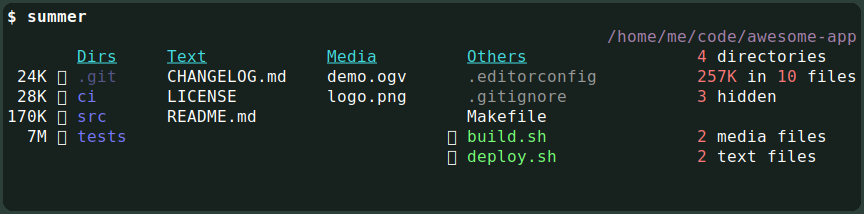

<h1 align="center">Summer</h1>

    

---

Summer is a [CLI] application that reads the contents of a directory, and
generates a summary based on a custom configuration.

:warning: *This README is a work-in-progress*

# Features

- Files and subdirectories can be matched by file name (either by glob or regex
  patterns), file type, MIME types, modification time, and git status.

- Matchers are used to organize files and subdirectories in columns, to apply
  styles, and to compute stats.

- The summary can include a header and an extra column with computed stats.

The screenshot at the top is generated using the [`filetypes.yaml` example].

# Installation

The [Releases page] contains precompiled packages for multiple operating
systems.

# Usage

Unfortunately, a proper documentation for the tool is still pending. The file
[`summer.yaml`] contains an explanation of every possible configuration setting,
and there are some examples in the [`examples`] directory.

The configuration file is set with the `-c` option.

If you invoke `summer` with no arguments, the configuration is read from the
`<config>/summer/config.yaml`, where `<config>` is the value from
[`dirs::config_dir`] (for example, `~/.config/summer/config.yaml` in Linux).

[CLI]: https://en.wikipedia.org/wiki/Command-line_interface
[Releases page]: https://github.com/ayosec/summer/releases
[`dirs::config_dir`]: https://docs.rs/dirs/4.0.0/dirs/fn.config_dir.html
[`examples`]: ./examples/
[`filetypes.yaml` example]: ./examples/filetypes.yaml
[`summer.yaml`]: ./summer.yaml
